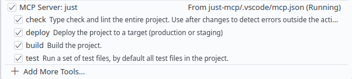

# just-mcp

This MCP server will expose tools from a Justfile specific to a project
directory. It uses a JSON dump of the Justfile to build the tools, including a
parameters schema and doc comments. When a recipe is executed, the output will
include all stdout and stderr from the recipe and a final line indicating the
exit code.

## Why

When working with a code assistant agent, you may find a feedback loop that
allows the agent to get lots of work done effectively by itself. This probably
needs an external shell command to generate the feedback, like a test suite, but
agents often hallucinate or generate commands that are counterproductive or even
dangerous. If you auto-approve this flow, you risk the agent running off the
rails and, say, spending $150 in tokens refactoring your entire Fresh project
into a Next.js project because it couldn't run a command intended for Next.js.
Or for a more mundane example, it will hallucinate its own way of adding
database migrations that will inevitably fail. You could provide a list of
commands and loads of details about your project in a prompt template, but this
is cumbersome to write and could confuse the agent even more. Some frontends
support a list of auto-approved commands, but won't allow the agent to specify
its own arguments, or have brittle pattern-matching that allows passing in
unwanted commands.

With tools from a Justfile, you keep the agent in a defined loop and avoid going
off-task due to a failed command. Since tool descriptions (provided as doc
comments) are part of every tool-enabled prompt, your agent will often pick up
these tools intuitively, without explicit instructions elsewhere. If you want it
to always run a tool before completing a task, mention that in a minimal prompt
template. This keeps the agent on-task, more focused on the details of the task,
and not bogged down with ancillary details about the project or intermediate
steps.

These tools are also much more trustworthy with auto-approval, but be aware that
it may be possible for the agent to edit the Justfile, and be instructed by a
malicious prompt to do so. This would be far out of the way for ordinary tasks,
and never happened to me unless asked specifically.

## How to use

If you don't already have a Justfile,
[get started with one](https://just.systems/man/en/quick-start.html). Make sure
you add helpful doc comments to your recipes that are intended for the agent,
like mentioning the name of the project to catch its attention.

Ensure [Deno](https://docs.deno.com/runtime/) is available on your system, then
add this server to your MCP client configuration as shown below. This example is
for the GitHub Copilot agent frontend.

```jsonc
// In your project at .vscode/mcp.json
{
    "servers": {
        "just": {
            "type": "stdio",
            "command": "deno",
            "args": [
                "run",
                "-A",
                // Use a specific commit unless you really trust me
                "https://raw.githubusercontent.com/ewired/just-mcp/b1dd6a1b871eefc13100d4bbd2ff533e3adad8d2/just.ts"
                // All further arguments are passed first to `just`
            ],
            "env": {
                "PROJECT": "${workspaceFolder}",
                "ALLOWED_RECIPES": "check,build,test,deploy",
                "NO_COLOR": "1" // Good idea to reduce junk characters in the output
            }
        }
    }
}
```

You may have to manually specify the `PROJECT` environment variable if your MCP
client does not run in the same directory as your intended Justfile. Goose will
run MCP servers in the working directory, but Cline and Copilot run them in your
home directory. Copilot can use VS Code variable substitution in its config, so
you can specify `PROJECT` as `${workspaceFolder}`.

If your agent supports it, prohibiting auto-approved edits to Justfile is
recommended.

### Environment variables

- `PROJECT`: Set the working directory (defaults to working directory of running
  MCP server)
- `ALLOWED_RECIPES`: Comma-separated list of recipe names to expose.
  **Careful:** if this isn't provided, all of them are exposed.
- `ENABLE_DEBUG_TOOL`: Set to enable the debug tool that shows the working
  directory

## Example usage

This example uses the `ALLOWED_RECIPES` env var as shown above. This Justfile
contains recipes that are helpful for people and agents working on the project:

```just
# Type check and lint the entire project. Use after changes to detect errors outside the active files.
check +files="just.ts":
    deno check {{files}}
    deno lint {{files}}

# Run a set of test files, by default all test files in the project.
test *test_files:
    deno test {{test_files}}

# Build the project.
build:
    @echo "The build is successful because you use Deno and there is no build step"

# Deploy the project to a target (production or staging)
deploy target="staging":
    @echo "Deployed to {{target}}"

# Drop the production database (intended only for humans with human brains)
drop_production_db:
    @echo "Sending your production data to heaven"
```

Now the tools are exposed to your fully automated unpaid junior developer,
except for the insanely dangerous ones:



## Recipe suggestions

Some suggested workflows that I developed while using this MCP server:

- **Run tests:** From the above example. Agents will often determine which test
  files are appropriate, and understand when to fall back to running all tests.
- **Check/lint:** From the above example. Some types or lint errors will not be
  exposed to the agent by the editor because they are not in any active files.
  An agent can use this tool before finishing a new feature and fix those
  errors. For example, a source file unknown to the editor/agent may have an
  exhaustive check of a type that was changed. It helps to include instructive
  comments that will be shown to the agent when a whole-project check fails:
  ```typescript
  // things.ts
  export type Thing = { name: "A" | "B" | "C" }; // I just added "C" here

  // thing_processor.ts
  switch (thing.name) {
      case "A":
          return "It's A!";
      case "B":
          return "Wow, it's B!";
      default: // Error: Type "C" does not satisfy never
          thing.name satisfies never; // Make sure to correctly process any new Things
          return;
  }
  ```
- **Add migration:** If you're using a database migration tool like dbmate that
  stores migrations by timestamp, this will help with adding migrations in a way
  that an agent can use correctly. It usually picks this tool up intuitively
  when it intends to change the database schema, otherwise creating an incorrect
  migration file without it. This recipe will open the new migration in VS Code
  if the recipe is being run directly in the terminal pane by a human user.
  ```
  # Create a new database migration and output the file's path. The migration name should be named in snake_case.
  add_migration name:
    @file=$(dbmate new {{name}} | grep -o "db/.*$") \
        && ([[ ! "${TERM_PROGRAM:-}" == "vscode" ]] || code $file); echo $file
  ```

## Roadmap

- [ ] **MCP Roots:** Maybe support MCP Roots if it's capable of changing tools
      based on a currently active root.
